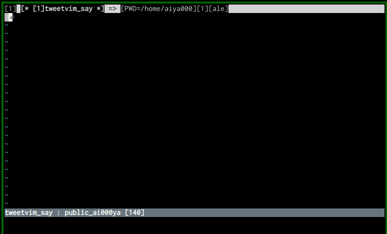

# :gift: neosnippet-emoji :gift:

This allows you and Vim to input kaomoji characters via [neosnippet.vim](https://github.com/Shougo/neosnippet.vim).

💪😎👍



## Why this is useful?

In many contexts, we cannot use emojis.

e.g.  
  filetype: `text`, `tweetvim_say`, and etc.  
  Or in `markdown` of GitHub Flavor Markdown, we cannot use not supported emojis.

But we want to use emojis everywhere, right?

This allows you to use emojis on everywhere 🥺✨

## Installation

For example, if you use `let g:neosnippet#snippets_directory='~/.vim/neosnippets'`.

- 1. Clone this repository

```shell-session
$ cd ~/.vim/neosnippets
$ git clone https://github.com/aiya000/neosnippet-emoji
```

- 2. Link it to a filetype you need

```shell-session
$ ls markdown || mkdir markdown  # or another filetype you like
$ cd markdown
$ ln -s ~/.vim/neosnippets/neosnippet-emoji/neosnippets/emoji.snip .
```

- :+1:. Now you can use this!
